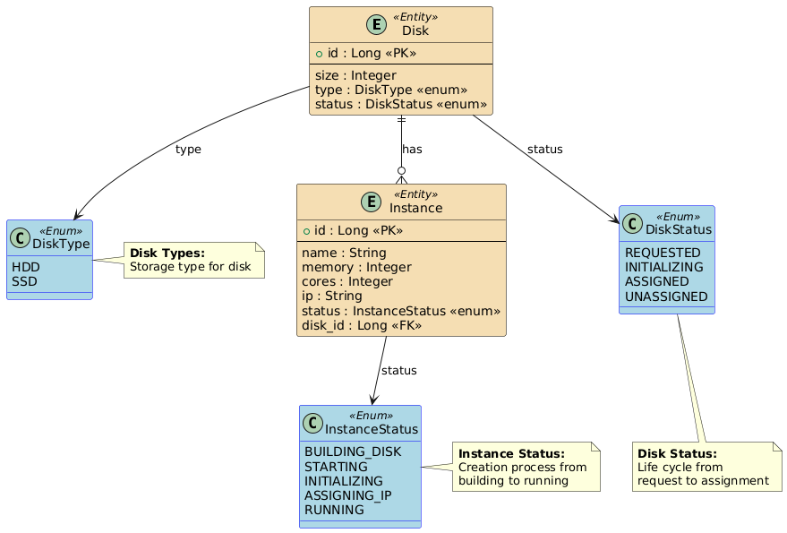
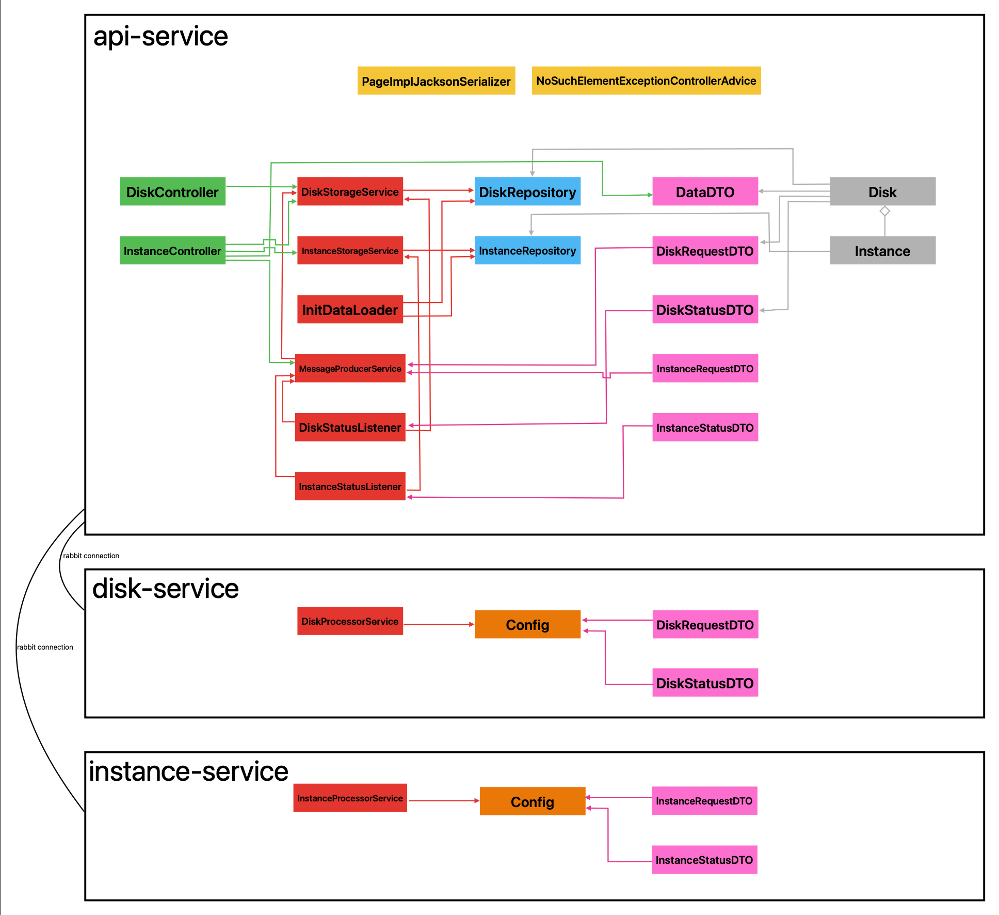

# CPD Project - Data Processing Center Management

## Project Description

Distributed application for managing a Data Processing Center (CPD) using microservices architecture with message queues for inter-service communication.

## Team Members

| Nombre                       | Email                              | GitHub                                       |
|----------------------------  |------------------------------------|----------------------------------------------|
| Alexander Mendoza Mendoza    | <a.mendozam.2022@alumnos.urjc.es>    | [GitHub](https://github.com/AlexanderMenMen) |
| Isam El Mourabet Ben Ahmed   | <i.elmourabet.2022@alumnos.urjc.es>  | [GitHub](https://github.com/isamelmourabet)  |
| Santiago Nicolás Díaz Tituaña| <sn.diaz.2022@alumnos.urjc.es>       | [GitHub](https://github.com/SantiagoDt)      |
| Cristian Laurentiu Sindila   | <cl.sindila.2018@alumnos.urjc.es>    | [GitHub](https://github.com/CristianInBits)  |

## Architecture

The system consists of 3 main services:

- **API Service**: REST API for managing instances and disks (Load balanced with 3 instances)
- **Disk Service**: Handles disk creation and status updates
- **Instance Service**: Manages virtual machine instances

### Technologies Used

- Spring Boot 3.5.0
- RabbitMQ for message queues
- MySQL database
- HAProxy for load balancing
- Docker & Docker Compose

## Database Entity Diagram

<p align="center">
  
</p>

## Class Diagram

<p align="center">
  
</p>

## Build and Deployment Instructions

### Prerequisites

- Docker and Docker Compose installed
- 8GB RAM minimum
- Ports 80, 3306, 5672, 15672, 8404 available

### Deploy with Docker Compose

```bash
# From the project root directory
cd cpd-project-app

# First-time deployment (initializes database schema and loads initial data)
docker-compose up --build

# Or run in background
docker-compose up -d --build
```

> [!CAUTION]
> For the **second and subsequent deployments**, you must disable schema initialization and data loading by setting the appropriate Spring profile and Hibernate strategy:
> This avoids **unintentional overwriting of existing data** in the database.

```bash
# For second and future deployments (avoids re-initializing database)
API1_SPRING_PROFILES_ACTIVE=no-init API1_SPRING_JPA_HIBERNATE_DDL_AUTO=validate docker-compose up --build
```

---

### Stopping and Cleaning Up Containers

```bash
# Stop containers
docker-compose down

# Stop containers and remove volumes (this deletes all data)
docker-compose down -v
```

---

### Build and Push Docker Images to Docker Hub

If you don't have Maven installed globally, run the following in each service folder first:
```bash
mvn wrapper:wrapper
```
And then:

```bash
# From the project root directory
cd cpd-project-app

# Build API Service image
cd api-service
./mvnw spring-boot:build-image \
  -Dspring-boot.build-image.imageName=[your-dockerhub-username]/cpd-api-service \
  -DskipTests

# Build Disk Service image
cd ../disk-service
./mvnw spring-boot:build-image \
  -Dspring-boot.build-image.imageName=[your-dockerhub-username]/cpd-disk-service \
  -DskipTests

# Build Instance Service image
cd ../instance-service
./mvnw spring-boot:build-image \
  -Dspring-boot.build-image.imageName=[your-dockerhub-username]/cpd-instance-service \
  -DskipTests
```

```bash
# Push images to Docker Hub
docker push [your-dockerhub-username]/cpd-api-service
docker push [your-dockerhub-username]/cpd-disk-service
docker push [your-dockerhub-username]/cpd-instance-service
```

### Verify Deployment

1. **Application**: <http://localhost>
2. **HAProxy Stats**: <http://localhost:80/haproxy?stats>

## Team Member Participation

### Alexander Mendoza Mendoza

**Tasks Performed:**

- Implemented the database integration
- Designed and implemented the RabbitMQ message queue system for inter-service communication
- Implemented comprehensive error handling and logging throughout the application

**5 Most Significant Commits:**

1. [Instance Processing Service - Message queue consumer and business logic](https://github.com/SantiagoDt/CPD-project/commit/6b4d5e86f784507e23521950d13ad3d9867a918c)
2. [Domain Model Implementation - Instance entities](https://github.com/SantiagoDt/CPD-project/commit/799491d4c9c074306e1d396a4ce0e68de05caeda)
3. [Core Service Layer Implementation - Storage and message services](https://github.com/SantiagoDt/CPD-project/commit/877391f033b0748f9c480b1add1cda97ae88199e)
4. [Instance DTOs Implementation - Request and Status data transfer objects](https://github.com/SantiagoDt/CPD-project/commit/587d9c67b139a0ae86e7d84815329f80bf3979e0)
5. [Project Initialization and Configuration - Initial setup and profile configuration](https://github.com/SantiagoDt/CPD-project/commit/67c78fb8d11ddf58ceb09823468ab3d2ab1a3e41)

**5 Main Files Contributed:**

1. [cpd-project-app/instance-service/src/main/java/es/urjc/instance_service/RabbitConfig/InstanceProcessorService.java](https://github.com/SantiagoDt/CPD-project/blame/dev/cpd-project-app/instance-service/src/main/java/es/urjc/instance_service/RabbitConfig/InstanceProcessorService.java)
2. [cpd-project-app/api-service/src/main/java/es/urjc/api_service/Model/Instance.java](https://github.com/SantiagoDt/CPD-project/blame/dev/cpd-project-app/api-service/src/main/java/es/urjc/api_service/Model/Instance.java)
3. [cpd-project-app/api-service/src/main/java/es/urjc/api_service/Service/InstanceStorageService.java](https://github.com/SantiagoDt/CPD-project/blame/dev/cpd-project-app/api-service/src/main/java/es/urjc/api_service/Service/InstanceStorageService.java)
4. [cpd-project-app/instance-service/src/main/java/es/urjc/instance_service/RabbitConfig/Config.java](https://github.com/SantiagoDt/CPD-project/blame/dev/cpd-project-app/instance-service/src/main/java/es/urjc/instance_service/RabbitConfig/Config.java)
5. [cpd-project-app/instance-service/src/main/java/es/urjc/instance_service/DTO/InstanceRequestDTO.java](https://github.com/SantiagoDt/CPD-project/blame/dev/cpd-project-app/instance-service/src/main/java/es/urjc/instance_service/DTO/InstanceRequestDTO.java)

---

### Isam El Mourabet Ben Ahmed

**Tasks Performed:**

- Implemented the database integration
- Designed and implemented the RabbitMQ message queue system for inter-service communication
- Implemented comprehensive error handling and logging throughout the application

**5 Most Significant Commits:**

1. [Disk entity - Adding disk model for database](https://github.com/SantiagoDt/CPD-project/commit/3f844180a914cc0e8fbcb4f96696e1bf4288fc25)
2. [Disk storage service - Adding disk storage service for storing disks](https://github.com/SantiagoDt/CPD-project/commit/4a85b0b57e6436b15da970329f17a3e5caa706a5)
3. [Adding rabbit queues - Configurating rabbitmq for disk-service](https://github.com/SantiagoDt/CPD-project/commit/d83eae9e1b7180d59a2163d29d5c81615b5be69c)
4. [Creating the disk consumer and producer for rabbit comunication](https://github.com/SantiagoDt/CPD-project/commit/62ecc0f460ebc3f4c64b0725fd6571a6cdf0ac5d)
5. [Adding bidirectional One to One relation for Disk and Instance](https://github.com/SantiagoDt/CPD-project/commit/4b9183640310316a18bea38fe12cb1f9aba95541)

**5 Main Files Contributed:**

1. [cpd-project-app/api-service/src/main/java/es/urjc/api_service/Model/Disk.java](cpd-project-app/api-service/src/main/java/es/urjc/api_service/Model/Disk.java)
2. [cpd-project-app/api-service/src/main/java/es/urjc/api_service/Service/DiskStorageService.java](cpd-project-app/api-service/src/main/java/es/urjc/api_service/Service/DiskStorageService.java)
3. [cpd-project-app/disk-service/src/main/java/es/urjc/disk_service/DTO/DiskRequestDTO.java](cpd-project-app/disk-service/src/main/java/es/urjc/disk_service/DTO/DiskRequestDTO.java)
4. [cpd-project-app/disk-service/src/main/java/es/urjc/disk_service/RabbitConfig/DiskProcessorService.java](cpd-project-app/disk-service/src/main/java/es/urjc/disk_service/RabbitConfig/DiskProcessorService.java)
5. [cpd-project-app/disk-service/src/main/java/es/urjc/disk_service/RabbitConfig/Config.java](cpd-project-app/disk-service/src/main/java/es/urjc/disk_service/RabbitConfig/Config.java)

---

### Santiago Nicolás Díaz Tituaña

**Tasks Performed:**

- Designed and implemented the initial base structure of the project repository  
- Configured branch protection rules for `dev` and `main` branches to ensure collaborative workflows via pull requests, requiring at least one approval before merging  
- Developed the `InstanceController`, implementing full CRUD operations for managing instances through RESTful endpoints  
- Created 1 DTO for input mapping in REST APIs and 4 additional DTOs to handle message structures exchanged via RabbitMQ  
- Implemented the `MessageProducerService` to send data through the message broker to connected services (`instance-service`, `disk-service`)  
- Designed and configured the `docker-compose.yml` to orchestrate multi-service deployment with containers  
- Contributed to the inter-service communication setup using RabbitMQ and helped manage Dockerized local environments  
- Compiled service images using Buildpacks (via Paketo) to generate OCI-compliant containers and pushed them to Docker Hub

**5 Most Significant Commits:**

1. [InstanceController implementation for CRUD](https://github.com/SantiagoDt/CPD-project/commit/1628e4c59b3bb3f4673b31843bde3f9e5b9e256e)

2. [Create DataDTO to structure incoming API requests](https://github.com/SantiagoDt/CPD-project/commit/ca224b182cf9dc8a3a11b8bacb28221db23d66c2)  

3. [Add DiskStatusDTO and DiskRequestDTO](https://github.com/SantiagoDt/CPD-project/commit/aee0ea617c16323692c6e393b072696ea254576c)  

4. [Add InstanceStatusDTO and InstanceRequestDTO](https://github.com/SantiagoDt/CPD-project/commit/aee0ea617c16323692c6e393b072696ea254576c)  

> [!NOTE]  
> *Although both this and the previous point were included in the same commit, they were initially planned as two separate logical contributions.*

5. [Configure full Docker Compose setup with HAProxy and environment profiles](https://github.com/SantiagoDt/CPD-project/commit/74bbdc3e03aeb5446cc93edf75a7490fcda116d3)  

**5 Main Files Contributed:**

1. [cpd-project-app/api-service/src/main/java/es/urjc/api_service/Controller/InstanceController.java](https://github.com/SantiagoDt/CPD-project/blame/dev/cpd-project-app/api-service/src/main/java/es/urjc/api_service/Controller/InstanceController.java)
2. [cpd-project-app/api-service/src/main/java/es/urjc/api_service/Dto/DataDTO.java](https://github.com/SantiagoDt/CPD-project/blob/dev/cpd-project-app/api-service/src/main/java/es/urjc/api_service/Dto/DataDTO.java)
3. [cpd-project-app/api-service/src/main/java/es/urjc/api_service/Dto/DiskStatusDTO.java](https://github.com/SantiagoDt/CPD-project/blob/dev/cpd-project-app/api-service/src/main/java/es/urjc/api_service/Dto/DiskStatusDTO.java)
4. [cpd-project-app/api-service/src/main/java/es/urjc/api_service/Dto/InstanceRequestDTO.java](https://github.com/SantiagoDt/CPD-project/blob/dev/cpd-project-app/api-service/src/main/java/es/urjc/api_service/Dto/InstanceRequestDTO.java)
5. [cpd-project-app/docker-compose.yml](https://github.com/SantiagoDt/CPD-project/blob/dev/cpd-project-app/docker-compose.yml)

---

### Cristian Laurentiu Sindila

**Tasks Performed:**

- Expanded the API Service with disk-management REST endpoints and database integration
- Integrated RabbitMQ event listeners to automate the disk → instance provisioning workflow
- Added HAProxy configuration to load-balance three API-service replicas with health checks
- Improved JSON handling with a custom page serializer and cycle-prevention annotations
- Standardised console messages, logging, and Docker-ready properties for MySQL / RabbitMQ

**5 Most Significant Commits:**

1. [Disk Controller – CRUD and pagination endpoints](https://github.com/SantiagoDt/CPD-project/commit/ca3168310d2ee7ffff0e17063c6bd41e8f92dbf0)
2. [Disk Status Listener – Consume `disk-statuses` queue and trigger instance flow](https://github.com/SantiagoDt/CPD-project/commit/e7f08678f74b3cd54ff08506d7bde1fa86028519)
3. [Instance Status Listener – Update instance states from `instance-statuses` queue](https://github.com/SantiagoDt/CPD-project/commit/47c0127abaa4e8b02f243e33da4d08064bfc97fa)
4. [PageImpl Jackson Serializer – Custom page JSON output](https://github.com/SantiagoDt/CPD-project/commit/b97aeb508e336318c97175247bf9114c79e43e4e)
5. [HAProxy & Properties Configuration – Load-balancing three API replicas and Docker-ready application.properties](https://github.com/SantiagoDt/CPD-project/commit/a65ac84dd979a87a736ce9573256a7abb656000e)

**5 Main Files Contributed:**

1. [`cpd-project-app/api-service/src/main/java/es/urjc/api_service/Controller/DiskController.java`](https://github.com/SantiagoDt/CPD-project/blame/dev/cpd-project-app/api-service/src/main/java/es/urjc/api_service/Controller/DiskController.java)
2. [`cpd-project-app/api-service/src/main/java/es/urjc/api_service/Rabbit/DiskStatusListener.java`](https://github.com/SantiagoDt/CPD-project/blame/dev/cpd-project-app/api-service/src/main/java/es/urjc/api_service/Rabbit/DiskStatusListener.java)
3. [`cpd-project-app/api-service/src/main/java/es/urjc/api_service/Rabbit/InstanceStatusListener.java`](https://github.com/SantiagoDt/CPD-project/blame/dev/cpd-project-app/api-service/src/main/java/es/urjc/api_service/Rabbit/InstanceStatusListener.java)
4. [`cpd-project-app/api-service/src/main/java/es/urjc/api_service/Config/PageImplJacksonSerializer.java`](https://github.com/SantiagoDt/CPD-project/blame/dev/cpd-project-app/api-service/src/main/java/es/urjc/api_service/Config/PageImplJacksonSerializer.java)
5. [`cpd-project-app/haproxy.cfg`](https://github.com/SantiagoDt/CPD-project/blame/dev/cpd-project-app/haproxy.cfg)

---

## Application Workflow

1. User sends POST request to create instance via HAProxy (port 80)
2. HAProxy distributes request between API service replicas  
3. API service creates disk and instance records in MySQL
4. API service sends disk creation request to RabbitMQ queue
5. Disk service processes request and sends status updates
6. When disk is ASSIGNED, API service requests instance creation
7. Instance service processes request and sends status updates with IP assignment
8. API service updates database with final instance status

## Load Balancer Verification

The HAProxy load balancer can be verified by:

- Accessing stats at <http://localhost:80/haproxy?stats>
- Making multiple requests and observing different hostname responses
- Stopping one API service replica and verifying continued operation
